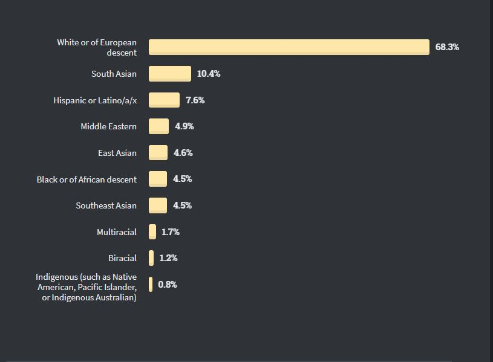

# Motibasyon

Bilang isang mag-aaral ng BS Computer Science, kinikilala ko ang malaking ambag ng teknolohiya sa hinaharap. Hindi maikakaila na ang pagbuo ng mga software ang isa sa mga kakailanganin sa bagong hangganang na ito. Isang malaking hakbang upang mahikayat ang mga software contributors ay ang adhikaing idemokratisa ang mga key technologies dito. Bagamat malayo na ang narating ng adhikaing ito, hindi maikakaila na malayo pa para matupad ng buo ang layunin.

Bilang isang halimbawa, kung titingnan ang pinakabagong datos ng Stack Overflow [2] (pinakamalaking komunidad ng software developers sa buong mundo na kasalukyan ay may 14 milyong aktibong miyembro), makikita na karamihan, 68.3%, sa mga programmers na ito ay “White or of European decent”. Habang ang “Southeast Asian” naman ay kakaunti lamang na 4.5%. Isa sa malinaw na dahilan nito ay halos lahat ng dokyumentasyon, code, at tutorial ay nasa wikang Ingles na hindi pansariling wika ng mga taong nais matuto sa Pilipinas o Southeast Asia. Ang mga salitang katulad ng “data structure and algorithms” na madalas mabanggit sa larangang ito ay hindi likas na mahuhulma sa intwisyon ng mga hindi mahusay mag-Ingles.

Ang pag-aaral ng programming at pag-aaral ng Ingles ay magkaibang bagay. Ang intwisyon at konsepto sa pag-gawa ng mga program at sa pagkabihasa sa Ingles ay eksklusibo sa isa't isa. Subalit dahil karamihan ng tutorials, aralin, at resources para sa mga mag-aaral ay nasa wikang Ingles, tila ba ay nagmumukha itong isang kahingian bago matutuo mag-program. Dahil dito ay napagiiwanan ang mga kababayan nating hindi ganun kagaling sa Ingles.

Ang ganitong sitwasyon ay naobserbahan rin ni Guo, Philip noong 2018 sa kanyang pag-aaral na pinamagatang ["Non-Native English Speakers Learning Computer
Programming: Barriers, Desires, and Design Opportunities"](https://pg.ucsd.edu/publications/non-native-english-speakers-learning-programming_CHI-2018.pdf) [1] kung saan sinabi nya na

> We found that
> non-native English speakers faced barriers with reading instructional materials, technical communication, reading and
> writing code, and simultaneously learning English and programming.

Kung gayon, ang simpleng website na ito ay ginawa upang matulungan ang kapwa nating Filipino programmers kahit ano man ang nakasanayang wika nila. Upang maibsan ang suliranin nila sa pagtuto ng programming, itinala dito ang iba't ibang resources, komunidad, tutorials, at content creators na ginagamit ang wikang Filipino.

Sa paggamit ng wikang Filipino sa larangan ng software development, sa aking opinyon, ay mapapalapit ang wikang Filipino sa mga konsepto ng software development at mapapadali ang pag-aaral nito. Sa aking pananaw, ang paggamit din ng wikang Filipino sa software development ay mas madaling behikulo papunta sa globalisasyon at internasyonalisasyon kumpara sa mga larangan na matagal nang naitatag, ito ay sa kadahilanang ito ay bago pa at marami pang oportunidad upang makilahok ang mga Pilipino at ang ating wika.

Ang paggamit ng pansariling wika sa software development ay magbibigay daan upang makabuo tayo ng aktibong lokal na komunidad at makatatag ng matibay na propesyonal na kulturang panteknolohiya.

### References

[1] Non-Native English Speakers Learning Computer Programming: Barriers, Desires, and Design Opportunities. Philip J. Guo. ACM Conference on Human Factors in Computing Systems (CHI), 2018.

[2] Stack Overflow (2020) Stack Overflow Developer Survey 2020. Available at: https://insights.stackoverflow.com/survey/2020#technology-most-loved-dreaded-and-wanted-languages-dreaded
